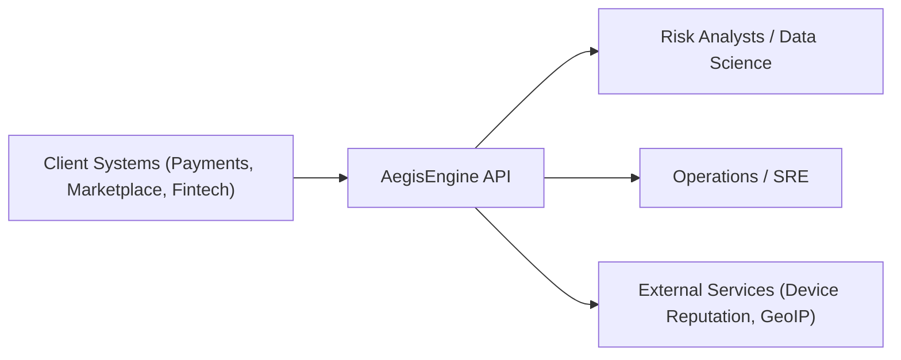
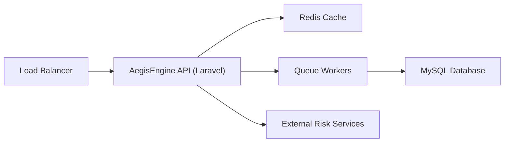
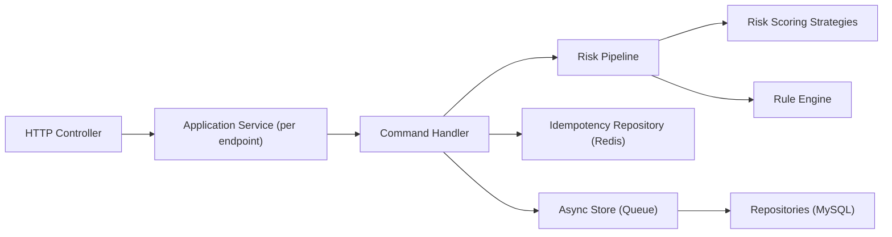
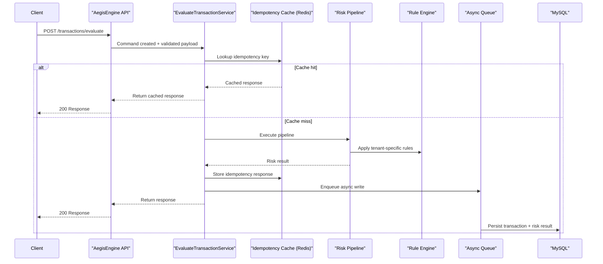

# PulseGuard Fraud API (Laravel 11)

This repository contains a Clean Architecture / Hexagonal backend for real-time fraud detection and risk scoring.

## Key points

- Domain is framework-agnostic.
- Per-endpoint application services (e.g., EvaluateTransactionService).
- Strategies + Rule engine + Pipeline evaluation.
- Async persistence (queue) to keep request path fast.
- Redis idempotency cache.

## Providers to register

If you use a different Laravel 11 bootstrap, ensure these providers are registered:

- `App\Providers\RiskServiceProvider`
- `App\Providers\RateLimitServiceProvider`

## Endpoint

- `POST /api/transactions/evaluate` (amount is in minor units; e.g., 150000 = $1,500.00)
- `GET /api/health`

## Load test

Run with k6:

```bash
k6 run scripts/load_test.js
```

**AegisEngine Architecture & Technical Explanation**

**Executive Summary**  
AegisEngine is a high-throughput, real-time Fraud Detection and Risk Scoring API built to evaluate transaction events at scale (10+ million HTTP requests/day) with consistent latency and strong tenant isolation. It exists to provide a configurable risk decisioning layer that can be embedded into payment, marketplace, or fintech workflows without coupling fraud logic to product systems.  
Primary users are platform engineers, risk teams, and data science teams who need to deploy and evolve fraud logic safely.  
Core value proposition: deterministic, low-latency scoring with tenant-specific rules, extensible scoring strategies, and operational controls (idempotency, rate limiting, async persistence) that keep the request path fast and reliable.

**System Overview**  
AegisEngine follows Clean Architecture + Hexagonal principles to keep domain logic independent of frameworks and infrastructure. The system is organized into:

- Domain: core risk model and evaluation rules
- Application: endpoint-specific services and commands
- Infrastructure: persistence, cache, queue, adapters
- Interfaces: HTTP controllers, request validation, response resources
- Providers: DI and runtime bindings

Separation of concerns is critical to prevent risk logic from being polluted by transport, storage, or framework concerns. This allows safe evolution of algorithms and rules while keeping performance optimizations and infrastructure changes isolated.  
Each HTTP endpoint has its own application service to avoid "god services" and to enforce explicit command boundaries. This preserves clear ownership of validation, orchestration, and response shaping per endpoint, which is critical when endpoint semantics diverge over time (e.g., evaluation vs. rule updates vs. audit replay).

**Core Functional Flow**  
Transaction evaluation request flow:

1. HTTP request arrives at `/transactions/evaluate`.
2. Request validation ensures schema, types, and tenant context are correct.
3. A command is created and passed to the endpoint-specific application service.
4. Risk pipeline executes:
   - Enrichment step builds derived features.
   - Strategies compute risk contributions (e.g., device reputation, amount velocity).
   - Rule engine applies tenant-specific adjustments.
5. A consolidated risk result is produced.
6. Response is returned immediately.
7. Persistence happens asynchronously (queue) to keep latency stable.

**Domain Model Explanation**

- Aggregates:
  - `Transaction` aggregate, with associated risk evaluation result.
- Entities:
  - `Transaction`, `RiskResult`.
- Value Objects:
  - `Money`, `TenantId`, `RiskScore`, `DeviceInfo`, `GeoLocation`.
- Domain Events (conceptual):
  - `TransactionEvaluated`, `RuleApplied`, `HighRiskDetected`.
  - Used for audit trails or downstream pipelines (optional integration).
- Risk Scoring Abstraction:
  - `RiskScoringStrategy` interface provides pluggable scoring algorithms.
  - `RuleEngine` interface applies tenant-specific business policies.

**Design Patterns Used**

- Strategy Pattern:
  - Enables multiple scoring algorithms with consistent interface.
- Factory Pattern:
  - Rule engine instantiation varies per tenant and can be cached.
- Pipeline Pattern:
  - Explicit processing chain for enrichment, scoring, rule application, aggregation.
- Repository Pattern:
  - Persistence boundary for domain entities.
- Command Pattern:
  - Encapsulates endpoint requests as command objects.
- Adapter Pattern:
  - External services (device reputation) via infrastructure adapters.
- Dependency Injection:
  - All concrete implementations are resolved at the edges.

**Scalability Design**

- Stateless architecture:
  - All request processing is stateless and horizontally scalable.
- Horizontal scaling:
  - Multiple API nodes behind a load balancer.
- MySQL indexing strategy:
  - Composite indexes on tenant + transaction identifiers and time slices.
  - Supports queries by tenant, time, and risk severity.
- Redis caching layer:
  - Idempotency key resolution and rule caching.
- Queue-based async writes:
  - Async persistence reduces tail latency.
- Idempotency handling:
  - Avoids double-processing during retries.
- Avoiding bottlenecks:
  - External calls are cached and time-bounded.
- 10M/day handling:
  - With 10M/day, average throughput is ~116 req/s, with peaks assumed 10–20x.
  - Design targets sub-50ms evaluation path under load.

**Performance Considerations**

- O(1) rule lookup:
  - Tenant rules are cached in memory (Redis).
- Optimized DB access:
  - Writes are async; reads in request path are avoided.
- Avoiding N+1:
  - Rule fetching is a single query per tenant, cached.
- Request lifecycle efficiency:
  - Request path is bounded: validation → pipeline → response.
- Memory usage control:
  - DTOs and value objects keep data precise; large payloads avoided.

**Security Considerations**

- Rate limiting:
  - Per-tenant limits to prevent abuse and noisy neighbor impact.
- Input validation:
  - Strict request schema validation per endpoint.
- Tenant isolation:
  - Tenant ID enforced on all storage and rule resolution.
- API authentication strategy:
  - HMAC or token-based auth (e.g., OAuth2 client credentials).
  - Token validation should be done at the edge to minimize overhead.

**Observability & Reliability**

- Logging strategy:
  - Structured logs with request IDs and tenant identifiers.
- Metrics:
  - Latency percentiles, scoring distribution, rule hit counts.
- Health checks:
  - `/health` endpoint for liveness and readiness.
- Circuit breaker concept:
  - External reputation services guarded to avoid cascading failures.
- Retry mechanisms:
  - Limited retries for external adapters; async write retries in queue.

**Testing Strategy**

- Domain unit tests:
  - Strategy scoring and rule evaluation behaviors.
- Feature tests per endpoint:
  - Validation, response shape, idempotency.
- Performance testing:
  - Load testing via k6 or Gatling with realistic traffic profiles.
- Mocking strategies:
  - External adapters and repositories mocked for deterministic tests.

**Why This Architecture Demonstrates Senior-Level Engineering**

- Strong separation of concerns prevents accidental coupling.
- Domain logic is framework-agnostic and portable.
- Clear command boundaries enable safe scaling of features.
- Explicit performance trade-offs (async persistence, caching) reduce tail latency.
- Reliability and observability are first-class, not add-ons.
- Design anticipates growth and changing risk strategies without rewrites.

**C4-Style Diagrams (Text Form)**

**Context Diagram**



**Container Diagram**



**Component Diagram**



**Sequence Diagram: Transaction Evaluation**



If you want this document converted to an internal RFC or added to `/Users/farzad/Desktop/_/PulseGuard/README.md`, say the word and I’ll format it accordingly.
